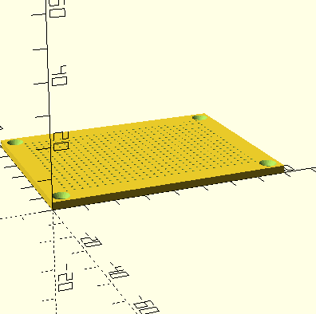

# circuit mesh

A parametric 3D-printable prototyping board for poke-through component mounting. Push component leads through the holes, twist or solder connections underneath — same workflow as the classic paper-over-cardboard method, but reusable and dimensionally consistent.

---

## Hammond die-cast enclosure presets

Set the `preset` parameter to size the board footprint automatically for a standard Hammond die-cast enclosure. The board will fill the enclosure's L × W outer footprint; `enclosure_height` is set as a reference so you know how much vertical clearance you have.

| Preset    | L (mm) | W (mm) | H (mm) | Notes                        |
|-----------|--------|--------|--------|------------------------------|
| `1590A`   |  92.5  |  38.5  |  31    | Micro, single-knob builds    |
| `1590B`   | 112    |  60    |  31    | Standard "Boss-style" pedal  |
| `1590BB`  | 119    |  94    |  34    | 3–4 knob builds              |
| `125B`    | 121    |  66    |  39    | Deeper 1590B alternative     |
| `custom`  | —      |  —     |  —     | Use `custom_board_width` / `custom_board_depth` |

`board_thick` (PCB thickness, default 2.5 mm) is independent of the preset and should be adjusted separately based on your material and grip preference.

---

## print settings

- **Material:** TPU recommended for best grip. PETG works. PLA is functional but stiff.
- **Layer height:** 0.15–0.2mm
- **Infill:** 100% (it's thin — just do it)
- **Supports:** None needed
- **Orientation:** Flat on the bed, holes vertical
- **Nozzle/speed:** Small holes benefit from a 0.4mm nozzle and slow perimeter speed (20–25mm/s). Larger nozzles or fast speeds may produce irregular holes.

---

## parameters

Open `circuit_mesh.scad` in [OpenSCAD](https://openscad.org) and adjust the values at the top:

| Parameter | Default | Description |
|---|---|---|
| `preset` | `"custom"` | Hammond enclosure preset — see table above |
| `custom_board_width` | 80mm | Board width, used only when `preset = "custom"` |
| `custom_board_depth` | 60mm | Board depth, used only when `preset = "custom"` |
| `board_thick` | 2.5mm | Thickness — more grip, harder insertion. Can be reduced to 2.0mm for lighter builds; consider 3mm if using screw holes |
| `hole_dia` | 0.85mm | Lead hole diameter — tune per material |
| `pitch` | 2.54mm | Hole spacing (standard component pitch) |
| `margin` | 5mm | Border around the hole grid |
| `add_screw_holes` | true | Corner M3 mounting holes with countersink — set to false to disable |
| `screw_margin` | 4mm | Distance from board corner to screw center |
| `countersink_dia` | 6.0mm | M3 flat head countersink diameter |
| `countersink_depth` | 1.5mm | Depth of countersink recess |

Hit **F6** to render, then **File → Export → STL**.

### hole diameter tuning

FDM printers tend to print holes slightly larger than specified. Hole size significantly affects insertion feel and component grip. Suggested starting points:

- TPU: 0.85mm
- PETG: 1.2–2.0mm (larger holes work better in practice; leads can be gently bent to seat firmly, and the other side is soldered anyway)
- PLA: 0.75–0.85mm

Note: Resin printers may require tighter tolerances (closer to 0.85mm) due to higher accuracy.

---

## example stl

A pre-exported STL with default settings is in the `renders/` folder if you just want to print without running OpenSCAD.

---

## use

- Push component leads through from the top
- Twist leads together underneath to connect, or solder for permanent joints
- Standard 2.54mm pitch means DIP ICs, resistors, capacitors, TO-92 transistors all fit naturally

---

## license

MIT
